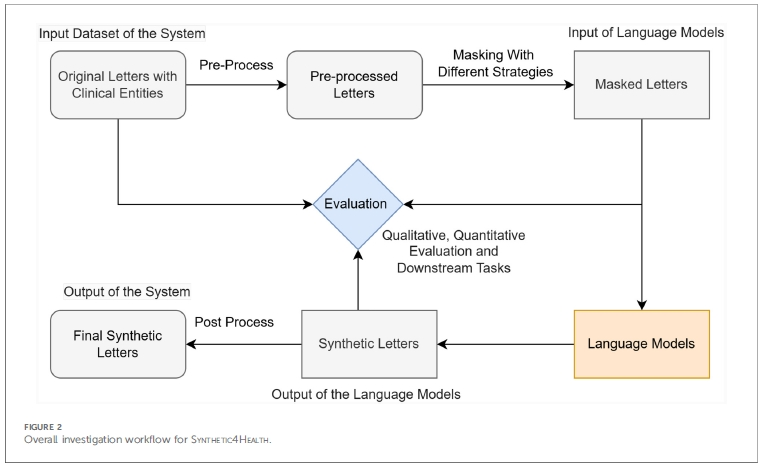

# プロジェクト(Project)
　本プロジェクトは松尾研LLM CommunityにおけるLLMatchでの電子カルテプロジェクトの
取組みの一つである。希少ウィルス感染の自由形式のカルテからFHIR形式の構造化電子カルテを
作成することが目的である。本GithubではMask-Filling手法による合成データの試行
について記載している。Mask-Filling手法については関連リンクに論文を示している。<br>


## プログラム及びデータ概要(Program and Data Overview)
<11_入力ファイル><br>
karte_example.csv：PubMDから抽出の症例5サンプル<br>
※フルサンプルのファイルは石田さんに依頼ください。<br>
<21_バッチ処理関連ファイル(1)><br>
run_mask_trial3.bat：Mask化バッチ処理Trial3<br>
run_mask_filling_trial4.bat：Filling化バッチ処理Trial4<br>
<22_ソースプログラムファイル><br>
mask_trial2.py：Mask化処理拡張版<br>
mask_trial3.py：Trial2+医学的誤Mask防止版<br>
mask_filling_trial3.py：制約付きFillingの基盤<br>
mask_filling_trial4.py：Trial3に安全性filterと品質検証を追加<br>
<31_Jupyterノートブック処理関連ファイル(2)><br>
mask-trial3.ipynb：Mask化ノートブックTrial3<br>
mask-filling-trial4.ipynb：Filling化ノートブックTrial4<br>
<41_後処理プログラムファイル><br>
Dkt01.py：Mask化出力ファイルからMask化カテゴリ数算出<br>
Dkt11.py：Filling化出力ファイルから必要カラム抽出<br>

## フォルダ構成(Folder Structure)
　フォルダ構成を以下に示す。(1)バッチ処理時はローカルPC上の構成を示す。
(2)ノートブック処理時はGoogle Driveにマウント後の構成を示す。<br>
<details>
  <summary>ディレクトリ構成を開く</summary>
MyDrive/<br>
   └─ LLMatch2026/<br>
      ├─ mask-trial3.ipynb<br>
      ├─ mask-filling_trial4.ipynb<br>
      ├─ src/<br>
      │  ├─ mask_trial2.py<br>
      │  ├─ mask_trial3.py<br>
      │  ├─ mask_filling_trial3.py<br>
      │  └─ mask_filling_trial4.py<br>
      ├─ example/<br>
      │  └─ karte_example.csv<br>
      ├─ mask_trial_outputs/<br>
      └─ mask_filling_outputs/<br>
</details>

## 動作環境(Execution Environment)
(1)バッチ処理<br>
- Windows / Python(Anaconda等)など<br>

(2)ノートブック処理<br>
- Google Colabo (with GPU)<br>

## 基本的な使い方(Basic Usage)
(1)バッチ処理<br>
ローカルPCで実行する場合はPython実行環境の構築が必要です。一方、GPU付きPCは
処理自体には必須ではありません。ただし、現在のバッチファイルはGPU使用を前提
にしています。<br>
### 環境構築
依存一覧はリポジトリ直下の`requirements.txt`です。Python 3.12を用意し、WSL内でリポジトリへ移動して次を実行します。バッチが参照する仮想環境は`~/.venvs/maskfill_env`です。

```bash
python3.12 -m venv ~/.venvs/maskfill_env
source ~/.venvs/maskfill_env/bin/activate
python -m pip install --upgrade pip
python -m pip install -r requirements.txt
python -m spacy download en_core_web_sm
python -c "import torch; print(torch.cuda.is_available())"
```

FillingバッチにはCUDA対応GPUとドライバーが必要です。上の確認が`False`の場合はCUDA環境を確認してください。CPUで実行する場合はPythonプログラムを直接呼び出し、`--device cpu`を指定します。

- コマンドプロンプトを開く<br>
- WSLが利用できるか確認する<br>
　WSLがインストールされていない場合は、 wsl --install -d Ubuntu<br>
- GPUがWSLから認識されるか確認する<br>
- 必要な基本コマンドをインストールする<br>
　sudo apt update<br>
　sudo apt install -y curl ca-certificates<br>
- uvがインストールされているか確認する<br>
- Python 3.12をインストールする<br>
- maskfill_env 仮想環境を作成する<br>
- pipを更新する<br>
- CUDA対応PyTorchをインストールする<br>
- GPUがPyTorchから認識されるか確認する<br>
- Pythonファイルの構文を確認する<br>
- WSLを終了する<br>
- リポジトリへ移動する<br>
### Mask化処理実行
- コマンドプロンプトを開く<br>
- プロジェクトフォルダへ移動する<br>
　cd /d C:\LLMatch2026<br>
- 入力CSVが存在することを確認する<br>
- 症例をMask化する<br>
　run_mask_trial3.bat example/karte_example.csv mask_trial_outputs<br>
　※3番目に引数で数字を付けると処理する症例数を示す。<br>
- 正常終了メッセージを確認する<br>
　CSV saved: mask_trial_outputs/clinical_case_mask_trial3_YYYYMMDD_HHMMSS.csv<br>
　TXT saved: mask_trial_outputs/clinical_case_mask_trial3_YYYYMMDD_HHMMSS.txt<br>
### Filling化処理実行
- コマンドプロンプトを開く<br>
- プロジェクトフォルダへ移動する<br>
　cd /d C:\LLMatch2026<br>
- Mask化CSVを確認する<br>
- Filling処理を実行する<br>
　run_mask_filling_trial4.bat "" mask_filling_outputs 3 10 10<br>
  第1引数：入力CSV。""の場合は最新のMask化CSV<br>
  第2引数：出力フォルダ<br>
  第3引数：処理する入力症例数<br>
  第4引数：1症例当たりの生成数<br>
  第5引数：TOP_K<br>
- 実行設定を確認する<br>
  処理開始時に次のような表示が出ます。<br>
  [INFO] Input CSV           : mask_trial_outputs/clinical_case_mask_trial3_YYYYMMDD_HHMMSS.csv<br>
  [INFO] Output dir          : mask_filling_outputs<br>
  [INFO] Augmentation factor : 10<br>
  [INFO] Top K               : 10<br>
  [INFO] Max rows            : 3<br>

(2)ノートブック処理<br>
Google Driveの`MyDrive/LLMatch2026`に上記構成を作成し、ノートブックを上から順番に実行します。依存パッケージが不足する場合は、Driveをマウントした後に次を実行してください。

```python
%pip install -r /content/drive/MyDrive/LLMatch2026/requirements.txt
!python -m spacy download en_core_web_sm
```

別の場所に配置する場合は、初期化セルより前に環境変数`HECTA_REPO_DIR`へリポジトリのパスを設定してください。<br>
**※この方法がMask-Filling手法を容易に確認可能である。**<br>

## 出力ファイルと保存先(Output Files and Storage)
Mask化処理とFilling化処理で異なるフォルダに結果ファイルが作成される。<br>
<Mask化出力ファイル:mask_trial_outputs><br>
clinical_case_mask_trial3_YYYYMMDD_HHMMSS.csv: Mask化出力ファイル<br>
<Mask化出力ファイル:mask_filling_outputs><br>
clinical_case_mask_filling4_YYYYMMDD_HHMMSS.csv: Filling化出力ファイル<br>

## マスク手法に依るデータ増強
　論文: SYNTHETIC4HEALTH: generating annotated synthetic clinical letters (Fig.2)<br>

### マスク処理フロー概要
- 1.前処理と特徴量抽出<br>
　マスクをかける前に、まず「何を隠し、何を残すべきか」を判断するための解析<br>
　　・構造の抽出(Structure Extraction):<br>
      コロン(:)や大文字の見出しなどを特定しカルテの骨組み(テンプレート)として維持<br>
　　・個人情報の特定(Privacy Information Identification):<br>
      氏名、日付、場所、電話番号、メールアドレスなどを、NER(命名エンティティ認識)
      や正規表現を用いて特定しこれらは必ずマスクの対象とする<br>
　　・医学用語･エンティティの認識:<br>
　　　病名、処置、薬品名などを特定。これらは臨床的な整合性を保つために原則として
　　　マスクせずに引用<br>
　　・品詞(POS)タグ付け:<br>
　　　名詞や動詞などを分類し後の「品詞ベースのマスク戦略」に使用<br>
- 2.マスク処理の実行<br>
　特徴抽出の結果に基づき、以下の戦略でテキストの一部を <mask> トークンに置換<br>
　　・ランダムマスク:<br>
　　　指定した割合(0%～100%)で単語をランダムに隠す<br>
　　・品詞ベースマスク:<br>
　　　名詞のみ、あるいは動詞のみを狙ってマスク<br>
　　・ストップワードマスク:<br>
　　　意味に影響の少ない単語(a, the等)をマスクし文の多様性を生み出す<br>
- 3.言語モデルによる穴埋め生成<br>
　マスク化テキスト(Msked Letters)を言語モデル(Bio_ClinicalBERT等)に入力<br>
　　・単語予測による<mask>部分の埋め合わせ<br>
　　・症例の臨床的事実を維持しつつ新合成カルテ生成<br>
- 4.後処理<br>
　　・匿名化個所の空白の充填<br>
　　・誤記等のスペル修正で品質向上<br>

### 使用モデル
- MLM(Masked Language Model)モデル(Bio_ClinicalBERT等)<br>
　Mask-fillingの中心処理のモデル<br>
- 生成AI(BioGPT, GPT-3.5-Turbo等)<br>
　評価(LLM-as-a-Judge)モデル<br>

### Mask穴埋め語彙リスト
Mask化対象語彙は以下の8つのカテゴリに分類してMask化されており、Mask化する際に
置換制約が定めらておりこれに基づいて語彙の置換処理を実施<br>
DATE,SEXはほぼ同じ値に固定。AGEはある程度の範囲でばらつく。
NAME,IDは全て異なる値となり、LOCATION,ORGANIZATION,LOW_RISK_WORDINGは
4-5種類の範囲である程度ばらつく。置換制約(replacement_constraints)は
人間向けの制約説明であり、ルールベース処理では変更しても Filling 結果には
それほど影響しない。Filling が実際に参照する制御情報は、mask_metadata +
 FillingConfigである。<br>

| Mask化カテゴリ | 置換制約(replacement_constraints) |
| ---- | ---- |
|AGE | 同じ年齢区分（成人）内でのみ置き換え、年齢表記はそのまま維持する|
|DATE | 同じケース内のすべての日付を同じオフセット分ずらし、時系列を維持する|
|ID | 同じ大まかな年代順の形式を用いて、架空の識別子に置き換える|
|LOCATION | 個人を特定できない架空の場所や大まかな場所に置き換える|
|LOW_RISK_WORDING | 同じ役割を持つ、臨床的に中立な単語のみに置き換える|
|NAME | 架空の人名または中立的なプレースホルダーに置き換えてください|
|ORGANIZATION | 架空の機関名または中立的なプレースホルダーに置き換えてください|
|SEX | 関連する代名詞や性別に関する事実がすべて一貫して更新されない限り、元の性別を維持することを優先する|

### 将来のマスク処理向けモデル
- Mask-filling向けモデルとして以下のモデルが検討されている。<br>
　・CLM(Causal Language Model: 因果的言語モデル)モデル<br>
　・ローカルLLM<br>

## 関連リンク(Related Links)
Mask-Filling手法による合成データ作成<br>
SYNTHETIC4HEALTH: generating annotated synthetic clinical letters<br>
https://www.frontiersin.org/journals/digital-health/articles/10.3389/fdgth.2025.1497130/full<br>
Generation and Evaluation of Realistic Synthetic Clinical Progress Notes for Prostate Cancer using Large Language Models<br>
https://www.medrxiv.org/content/10.64898/2026.05.25.26354027v1.full<br>
Are synthetic clinical notes useful for real natural language processing tasks: A case study on clinical entity recognition<br>
https://pmc.ncbi.nlm.nih.gov/articles/PMC8449609/<br>
Generating Synthetic Free-text Medical Records with Low Re-identification Risk using Masked Language Modeling<br>
https://aclanthology.org/2025.naacl-srw.20.pdf<br>

## 注意事項(Notes)
None


